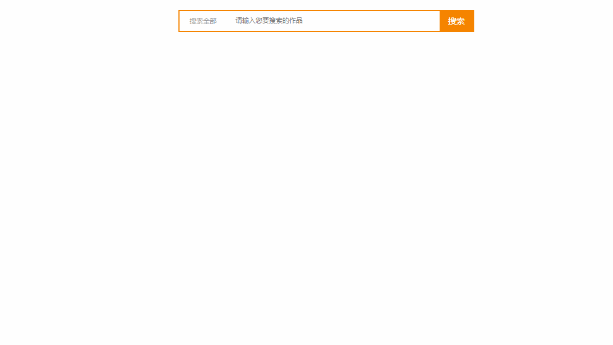

# searchSelected
搜索框带下拉选项


html code:
```
<!Doctype html>
<html lang="en">
<head>
	<meta charset="UTF-8">
	<title>搜索框特效</title>
	<link rel="stylesheet" href="css/base.css"/>
</head>
<body>
<div class="search radius6">
	<form name="searchform" method="post" action="/e/search/index.php">
		<input name='ecmsfrom' type='hidden' value='9'>
		<input type="hidden" name="show" value="title,newstext">
		<select name="classid" id="choose">
			<option value="0">搜索全部</option>
			<option value="1">新闻中心</option>
			<option value="4">技术文档</option>
			<option value="22">下载中心</option>
		</select>
		<input class="inp_srh" name="keyboard"  placeholder="请输入您要搜索的作品" >
		<input class="btn_srh" type="submit" name="submit" value="搜索">
	</form>
</div>
</body>
</html>
<script src="js/jquery-1.8.3.min.js"></script>
<script src="js/jquery.select.js"></script>
```
js code:
```
(function($) {
	var selects = $('select');
	for (var i = 0; i < selects.length; i++) {
		createSelect(selects[i], i)
	}
	function createSelect(select_container, index) {
		var tag_select = $('<div></div>');
		tag_select.attr('class', 'select_box');
		tag_select.insertBefore(select_container);
		var select_showbox = $('<div></div>');
		select_showbox.css('cursor', 'pointer').attr('class', 'select_showbox').appendTo(tag_select);
		var ul_option = $('<ul></ul>');
		ul_option.attr('class', 'select_option');
		ul_option.appendTo(tag_select);
		createOptions(index, ul_option);
		tag_select.toggle(function() {
			ul_option.show();
			ul_option.parent().find(".select_showbox").addClass("active")
		}, function() {
			ul_option.hide();
			ul_option.parent().find(".select_showbox").removeClass("active")
		});
		var li_option = ul_option.find('li');
		li_option.on('click', function() {
			$(this).addClass('selected').siblings().removeClass('selected');
			var value = $(this).text();
			select_showbox.text(value);
			ul_option.hide()
		});
		li_option.hover(function() {
			$(this).addClass('hover').siblings().removeClass('hover')
		}, function() {
			li_option.removeClass('hover')
		})
	}
	function createOptions(index, ul_list) {
		var options = selects.eq(index).find('option'),
			selected_option = options.filter(':selected'),
			selected_index = selected_option.index(),
			showbox = ul_list.prev();
		showbox.text(selected_option.text());
		for (var n = 0; n < options.length; n++) {
			var tag_option = $('<li></li>'),
				txt_option = options.eq(n).text();
			tag_option.text(txt_option).appendTo(ul_list);
			if (n == selected_index) {
				tag_option.attr('class', 'selected')
			}
		}
	}
})(jQuery);
```
